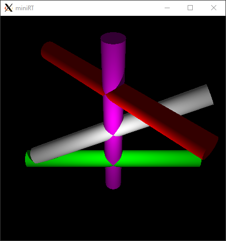
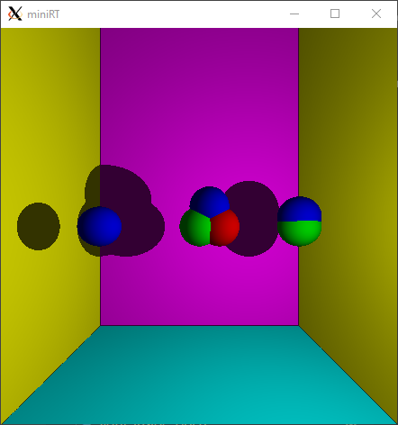
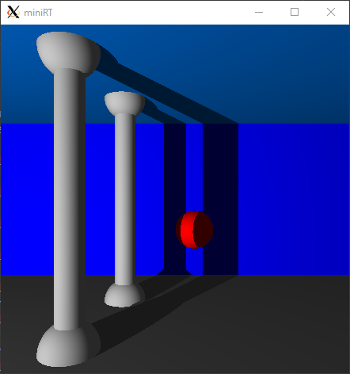

# miniRT

raytracing with spheres, planes, cylinders and lighting.

## Usage

1) install minilibx (API to interface with the display and user input)
2) `make` to build the program
3) `./miniRT <path-to-scene>` to run (take a look at the [scenes](./scenes/) folder)
4) hit escape or click the cross to end the program

## Examples

## Config possibilities

- change scene (edit file ending with `.rt`)
	- translate, rotate, color objects
	- change lighting
	- translate/rotate camera, change field of view (FOV)
- change window resolution (edit defines in [header-file](./mini_rt.h))
